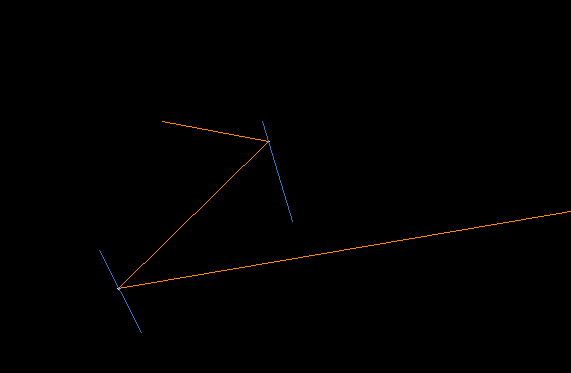
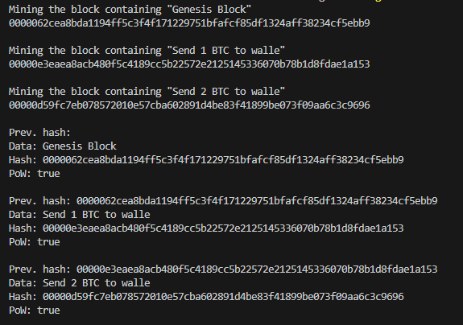
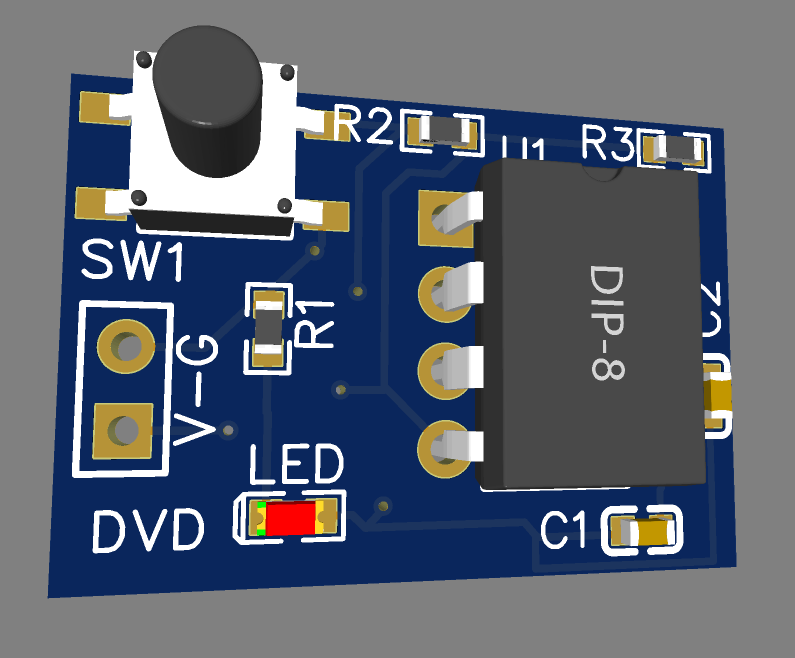
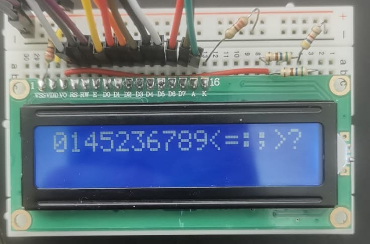
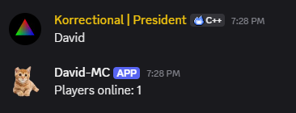

# EVERY WEEK

This a group of cool projects I did (almost) every week to learn new technologies


Here's information on some of the projects

<br>
<br>
<br>

# 1-7
I didn't care about the README till p.n. 8, so here's a quick rundown of those first 7: 0-HTML Canvas test, 1-A-Star Pathfinder, 2-AI image classifier, 3-Extenction that fakes human input (for a certain website), 4-Mandelbrot renderer, 5-Physics simulator, 6-Mouse behavior tracker, 7-Multiplayer clicker
<br/>
<br>

# 8-ASCII Camera
This takes in the information from the camera (using ```cv2```) and transforms it into ASCII art, realtime. (check out [this repo where I improved the cam and added some features](https://github.com/korrectional/ASCII-Camera))
### To run: ```python main.py```
### Used libraries: ```cv2, os```


<br/>
<br>

# 9-Door Movement Alarm
Little script for arduino device that plays a little alarm/ringtone each time someone opens/closes the door. This one was fun


<br/>
<br>

# 10-Operating System Kernel
Small kernel. 2 years ago I tried to do that and I failed, this is my comeback. This one only prints 'The KERNEL has arrived' into video memory. I plan to continue this project in its own repo


<br/>
<br>

# 11-Local Cloud
A couple small shell scripts I wrote as a local substitute to git while working on the week 10 project. While this was in the same week as the previous, I felt that I haven't had EW projects for so much time that I needed to drop 2 at once. The way it works is from a device you can either override the project version in the server or get the server version of the project. This allows to seamelessly work in a project in the same network with different devices. Nothing special really. Don't forget to create a .env file to store the password and adress of the server device.


<br/>
<br>

# 12-Web Scrapper
Simple python scripts that enters a website, scraps all the text (in my case, to feed a neural network) and looks for all the URLs and visits those tho, eventually going though all the public URLs in the website and taking all the juicy training material

<br/>
<br>

# 13-Language Model
A little language model that I created as a proof of concept (to myself). To run, you first need to run the scrapper (which extracts a bunch of text from wikipedia) and depending on how long you run it, you'll get a more complex model. Then train it with ```train.py``` and run with with ```run.py [first word] [second word] [number of words to generate]```. Note that that combination of two words has to exist inside your database (scrap.txt) in order for it to work. Don't worry though: when I had scrap.txt at ~25mb (and model at ~80mb) it could easily find most combinations of general words, stuff like "located in", "please do", "agreed to" and "wanted to". Have fun!


<br/>
<br>

# 14-Spotify Playlist Downloader
A simple, stupid and difficult to use program for directly downloading full spotify playlists that I made for my dad, as I couldn't find similar software.


<br/>
<br>


# 15-Smallest Executable
I tried following the procedure of Inkbox to create a really small executable file. While mine is much bigger than what he managed to do, Its still quite little and can fit into a QR code! Just a note: most of the binary is literally blank zero areas, which occupy 80% of the space. There is a way ~kind of~ to get rid of some of them by writing a custom PE and using crinkler, but I failed on that part (-_-)

Also, this took an crazy long amount of time.


<br/>
<br>


# 16-MC Bot
Stupid minecraft bot that has exactly 3 commands: "come" and it walks up to you, "collect X_BLOCK" and it neverendingly looks and collects that type of block, and "stop" (it's a mistery command). This is my shitty comeback to EW, been too busy attempting to build a processor.


That poor robot making a hole for me
<br/>
<br>
<br>


# 17-Smartass
I accidentally happened to make another unethical tool for students to bypass education (like HumanTyper). It's not even that I'm lazy. It's a stupid website my teacher uses, and it so happens to make us solve around 130 questions each week AFTER reading the whole material. That website is evil and has no consideration for students. To vent it out I just made a proof of concept tool that completely solves everything while the student does something healthy, like eat avocado. I just hope one day online classes won't suck because of some stupid programmers who don't give a shit about students. 


<br/>
the actual logo
<br>
<br>


# 18-Lazers
I was watching the theory of the big bang and I liked the idea of lazers. So I went on to learn a couple new things: the vector reflection formula, parametric equations and Bresenham's line drawing algorithm (to display the lines). This project took a bit too long (sat there till 4AM in order to have time to do homework today), but the nice thing is that I not only learned how to reflect vectors, but also some 2D physics stuff. PickEngine and MtckEngine both use a system that I created last year (not saying its original, I just happened to come up with it cuz its so simple) to detect collisions, and it has big limitations, specifically that collision boxes can't be rotated in any way. This new one actually allows for much more flexibility, and is one of the first steps in writing a good 2D physics engine. Also, used SDL3 instead of SDL2 (evolution!). In order to run this, you will need to put the SDL3 binaries, lib and includes in this format: third_party/SDL3/(lib||bin||include). 


<br/>
<br>


# 19-GoChain
After a long time without EW (or practically any coding) here I am. While browsing the great internet, I happened to stuble upon the Go language, that I happened to want to learn for a while now. Nice syntax, anyway I made a simple blockchain. It uses the same Proof-of-Work algorith as Bitcoin, by making the miner attempt to hash the previous block hash with a number (nonce) as many times as possible until it finds a number that has a certain amount of zeroes at the start. I use 20 zeroes - in bits, so visually its 5 bytes - (more will hurt my computer). And no, I will not throw my coin into the already existing endless hole of shitcoins our internet has become.


<br/>
<br>


# 20-555PCB
I was watching a video by FluxBench (who happens to have an extremelly AI-like voice) and saw that he was using EasyEDA to make a PCB. Since I've seen people use that software before (although I did not know the name) I decided to try it out. Found out about a starter project called "555 blinker" which involves using a 555 chip (something like a controllable oscilator) to make a LED blink. Sadly the pins sort of confused me so I ended up spending an unconfortable amount of time looking at the "example usage" section of the TL documentation (the specific chip I used is called LM555). Now it's designed, and I love the 3d representation. And now, ofc I won't be ordering the PCB and soldering it because 1. It costs money 2. The components cost money 3. I don't have a soldering iron (it costs money). It was fun though, Ill make sure to design and actually get a pcb for a future project 


<br/>
<br>


# 21-ESPLCD
At 1AM last month, I robbed a friend from his 1602a LCD (who was about to depart for SCAD). It layed around for (guess what, a month) until I found a task for it: make a device that gives out the information of the nearest airplane. Haha sounds like a cool project and no, I did not do it (I'm still working on it; I'm new to esp-idf so this took longuer than expected). Anyway, I opened the docs for 1602a and did the Ben Eater thing: didn't use a library, instead engaged in direct communication. Took a second, (and for some reason everything displayed on the char table is shown in this order: 1452356789...) which is sort of weird and either a stupid error or an actual, quite cool, manufacturing defect. To run, do ```pio project init --board esp32dev --project-option="framework=espidf" --ide vscode``` then ```pio run --target upload```


<br/>
<br>


# 22-DavidMC
This morning I realized that to lead a purposeful senior year I must work on an operating system... for the third time (maybe now I'll succeed). And so I made a discord bot that tells us (the folk at the AKGD server) how many are currently online in our minecraft server. You just have to say my name! Useful for me cuz I hate playing on our server by myself, and it takes like 5 min for my minecraft to load.


<br/>
<br>
